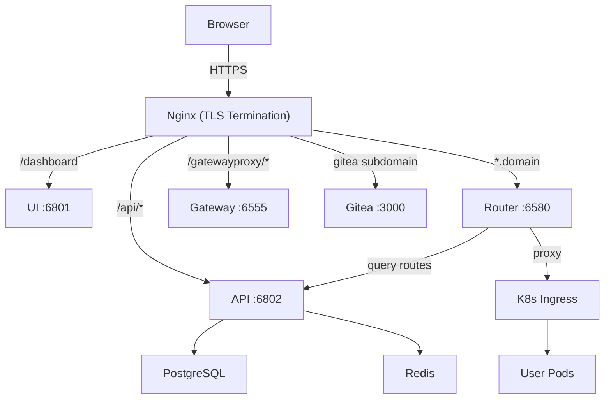

# AniLaunchpad

One-click deployment tool for the AniLaunchpad full-stack platform — a Go CLI with an interactive TUI wizard that provisions infrastructure, configures services, and brings everything online.

## Features

- **Express Install** — sensible defaults, just enter your domain
- **Custom Install** — full TUI wizard with tabbed configuration panel
- **Non-Interactive Mode** — supply a YAML config file for automated deployments (`--config FILE`)
- **Reconfigure** — modify a running installation without reinstalling (`configure`)
- **Runtime Settings Editor** — TUI editor for hot-reloadable application settings (`settings`)
- **3 SSL Modes** — Let's Encrypt (wildcard via DNS), self-signed CA, or bring-your-own certificates
- **Built-in or External Database** — auto-provisions PostgreSQL + Redis, or connect to existing instances
- **Built-in K3s or External Kubernetes** — single-machine K3s or connect your own cluster
- **Template Import** — Git repos and YAML templates embedded in the binary, auto-imported to Gitea
- **Lifecycle Management** — upgrade, restart, status, and uninstall commands
- **Telegram Integration** — configure bot notifications
- **Unified Progress Display** — real-time TUI progress with per-step status

## Prerequisites

| Dependency | Minimum Version | Notes |
|---|---|---|
| **Linux** | Any modern distro | macOS/Windows not supported |
| **Docker** | 20.10+ | Must be running (`docker info`) |
| **Docker Compose** | v2 | Plugin format (`docker compose`) |
| **helm** | 3.x | Only required for `kubernetes.mode: builtin` |

## Quick Start

```bash
# Express install (recommended for first install)
sudo launchpad install

# Full custom wizard
sudo launchpad install --custom

# Non-interactive with config file
sudo launchpad install --config setup.yaml
```

## CLI Reference

### Install & Configure

| Command | Description | Flags |
|---------|-------------|-------|
| `launchpad install` | Run installation wizard and deploy | `--custom`, `--config FILE`, `--resume`, `--dir` |
| `launchpad configure` | Reconfigure a running installation | |
| `launchpad configure export` | Export current config to file | `-o/--output FILE` |
| `launchpad settings` | Edit runtime settings (hot-reload TUI) | |

### Manage & Maintain

| Command | Description | Flags |
|---------|-------------|-------|
| `launchpad status` | Show service status | `--dir` |
| `launchpad upgrade` | Upgrade to a new version | `--version`, `--dir` |
| `launchpad restart [service]` | Restart one or all services | `--dir` |
| `launchpad uninstall` | Remove services and data | `--all`, `--dir` |
| `launchpad setup-certs` | Regenerate SSL certificates | `--dir` |
| `launchpad setup-db` | Initialize databases | `--dir` |
| `launchpad import-templates` | Re-import templates to Gitea | `--dir` |
| `launchpad setup-telegram` | Configure Telegram bot | `--token`, `--username`, `--dir` |

## Configuration Reference

```yaml
domain: example.com
subdomain: corp
admin_email: admin@example.com

images:
  registry: swr.ap-southeast-1.myhuaweicloud.com/ghisha
  default_version: "2.0.3"

ssl:
  mode: selfsigned           # letsencrypt | selfsigned | custom
  # dns_provider: cloudflare # required for letsencrypt
  # dns_api_token: "..."

database:
  mode: builtin              # builtin | external

kubernetes:
  mode: builtin              # builtin | external
  # kubeconfig: /path/to/kubeconfig
  storage_class: local-path

# Optional sections:
# smtp: { host, port, user, password, from }
# sso: { enabled, provider, entra_tenant_id, ... }
# storage: { mode, s3_bucket, s3_region, ... }
# telegram: { bot_token, bot_username }
# ai: { crs2_enabled, crs2_endpoint, ... }
# stripe: { secret_key, webhook_secret, publishable_key }
# experimental: { use_bun_runtime, debug_mode }

performance:
  api_replicas: 1
  router_replicas: 1
  db_conn_limit: 100
```

Save as `setup.yaml` and pass to `launchpad install --config setup.yaml`.

## Architecture Overview



Two deployment modes are supported:

- **Single Machine** (selfsigned + builtin K3s): everything on one server, K3s auto-installed, self-signed CA with Kyverno cert injection
- **Production** (letsencrypt/custom + external K8s): Let's Encrypt wildcard certs, connect to existing K8s cluster and database

## Project Structure

```
launchpad-setup/
├── cmd/
│   ├── launchpad/              # CLI entry point
│   └── gen-versions/           # Version constant generator
├── internal/
│   ├── cli/                    # Cobra command definitions
│   ├── config/                 # Config struct, validation, I/O
│   ├── engine/                 # Deployment engine (steps, health checks, orchestration)
│   ├── secrets/                # Secret generation and management
│   ├── settings/               # Runtime settings
│   ├── template/               # Embedded config templates + rendering
│   │   └── files/              # .tmpl and .yaml templates
│   ├── importfiles/            # Embedded Git repos + YAML for Gitea import
│   └── tui/                    # Terminal UI
│       ├── components/         # Shared styles, keymap, side menu
│       ├── wizard/             # Install wizard (express + custom)
│       ├── panel/              # Configure panel with tabs
│       ├── settings/           # Settings editor with tabs
│       └── progress/           # Deploy progress display
├── scripts/
│   └── deploy.sh               # Cross-compile + scp deploy helper
├── docs/                        # Design specs and plans
├── go.mod
├── go.sum
└── Makefile
```

## Development

```bash
# Build
make build                      # → bin/launchpad

# Build for Linux (cross-compile)
make build-linux                # → bin/launchpad-linux-amd64

# Run tests
make test

# Lint
make lint

# Deploy to remote server
./scripts/deploy.sh             # builds + scp to server
./scripts/deploy.sh --local     # build only, skip deploy
```

## Troubleshooting

| Symptom | Likely Cause | Fix |
|---------|-------------|-----|
| "connection refused" on port 6802 | API not healthy yet | `launchpad install --resume` or check Docker logs |
| Gitea HTTPS not reachable | DNS not configured or Nginx not ready | Check `/etc/hosts` or DNS records |
| Git push fails during template import | SSL cert not trusted | Self-signed: handled automatically; check Gitea health |
| Pods can't reach `*.domain` | CoreDNS or dnsmasq not configured | Check `kubectl get cm coredns-custom -n kube-system` |
| Cluster registration fails | API not reachable via public URL | Check DNS records; retry with `launchpad install --resume` |
| Database "role already exists" | Re-running init on existing DB | Safe to ignore — idempotent |

## License

Copyright (c) Gradient8. All rights reserved.
